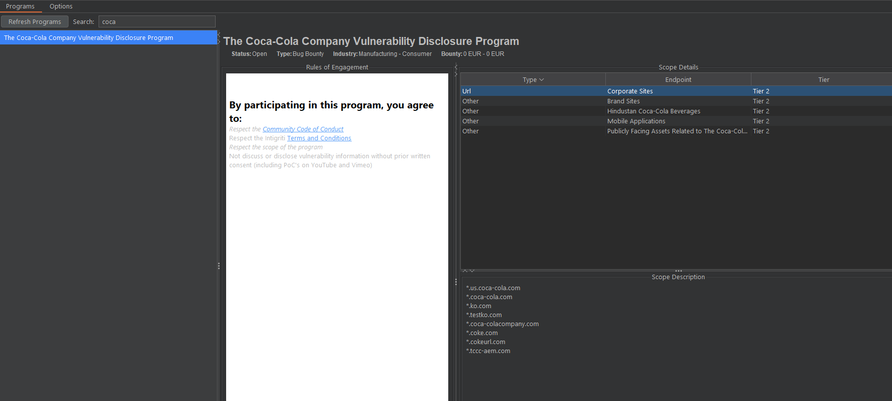

# Intigriti Burp Extension

A lightweight Burp Suite extension (Jython) to browse Intigriti bug bounty programs directly inside Burp.

## Features

- Connect to the Intigriti Researcher API with your API token
- Fetch and list up to 500 programs
- Search programs by name in real time
- View program details (status, type, industry, bounty range)
- Render Rules of Engagement from markdown-like content
- Display in-scope assets with tier and description
- Refresh program list on demand
- Persist API token in Burp extension settings

## Demo



## Requirements

- Burp Suite Community or Professional
- Jython standalone JAR configured in Burp (`2.7.x` recommended)
- Intigriti Researcher API token
- Internet access to `https://api.intigriti.com`

## Installation

1. Clone this repository:

```bash
git clone https://github.com/barttran2k/intigriti_burp.git
cd intigriti_burp
```

2. Configure Jython in Burp:
Open `Extender` -> `Options`, then in `Python Environment` select your `jython-standalone-2.7.x.jar`.

3. Load extension source:
Open `Extender` -> `Extensions` -> `Add`, then set:
- `Extension type`: `Python`
- `Extension file`: `src/addon.py`

4. Open the `Intigriti` tab in Burp.

## Quick Start

1. Go to `Intigriti` -> `Options`
2. Paste your Intigriti API token
3. Click `Save` (or `Test Connection`)
4. Once connected, switch to `Programs`
5. Use the search box or select a program to view details and scope

## Project Structure

```text
.
|-- BappManifest.bmf         # BApp metadata
|-- images
|   |-- demo.png             # Main UI screenshot
|   `-- test_connect.png     # Connection test screenshot
`-- src
    |-- addon.py             # Burp entry point
    |-- context.py           # Shared runtime context/settings
    |-- helpers.py           # HTTP + async helpers
    |-- BetterJava.py        # Swing helper components
    |-- style.css            # Rules renderer stylesheet
    |-- api
    |   |-- api.py           # Intigriti API client
    |   `-- models.py        # Program/scope models
    `-- Tabs
        |-- OptionsTab.py    # API token config + connection test
        `-- ProgramsTab.py   # Program list/details UI
```

## Troubleshooting

1. `ImportError` for Python/Jython classes:
Use Jython standalone JAR (`2.7.x`) in Burp `Extender` -> `Options`.
2. Extension loads but cannot fetch programs:
Recheck API token in `Options` and outbound access to Intigriti API.
3. UI shows connection error:
Run `Test Connection` in `Options` and inspect Burp Extender output.

## Notes

- Default API base URL: `https://api.intigriti.com/external/researcher/v1`
- Out-of-scope assets are filtered out from scope table display
